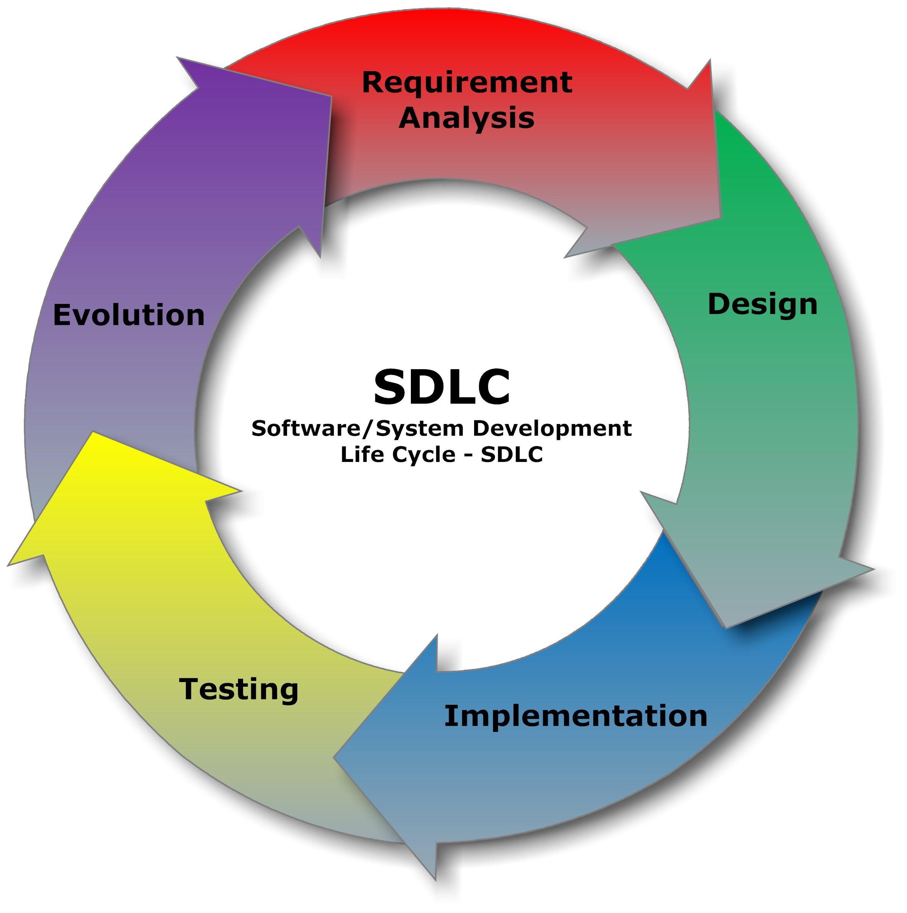

## Starting New
At the beginning of this course, I viewed software engineering as both the front-end and back-end development, working with both design and structure. I only expected to learn how to build websites, connect and create databases, and write front-end and back-end code. While these were important skills I did eventually gain, this course ultimately taught me that software engineering is less about technical skills, and more about structured thinking, collaboration, and long-term supportability. Through concepts such as configuration management, agile project management, and design patterns, I learned principles that apply far beyond web development.

---

## Configuration Management
One fundamental concept I learned is configuration management. Configuration management is the process of tracking, controlling, and managing changes to software artifacts such as source code, dependencies, and environments. In this course, I practiced configuration management through version control systems such as Git and GitHub. By using commits, branches, and pull requests, I learned how to keep track of changes, collaborate with others, and recover from mistakes. For example, in my final project, RateMyTools, my team and I split the milestones into goals, which we each worked on in our own branch via GitHub. This management system made the process of combining our work together much smoother, allowing us to combine any changes made in a simple click. And from milestone to milestone, we were able to keep track of each version, and make any changes or reversions if necessary.

Beyond web applications, configuration management is essential in any software project where multiple people work together or where systems evolve over time. For example, in game development, management ensures that changes are documented, reproducible, and reversible.

---

## Agile Project Management
Another major concept I learned is agile project management, specifically Issue-Driven Project Management. Agile project management is an approach that emphasizes incremental progress, flexibility, and continuous feedback rather than long-term planning. Issue-driven development organizes work into small, manageable tasks called issues, which represent features, bugs, or improvements. In this course, issues helped structure my final project development by clearly defining goals and tracking progress. For each milestone, my team and I organized issues related to the requirements, which ultimately kept our workflow clean and efficient. 

This approach can be applied almost anywhere, e.g. cooking, building a computer, etc. Essentially, breaking large goals into smaller issues makes complex projects more manageable and adaptable to change.

## Design Patterns
The course also introduced me to design patterns, which are reusable solutions to common software design problems. Design patterns are not specific pieces of code, but general strategies that guide how systems are structured. I utilized multiple Design patterns in my final project, where we shared a single Prisma client, an example of the Singleton pattern, and the Observer pattern, keeping the interface response and in-sync.

This concept can be applied into areas like desktop software, APIs, and game engines. Recognizing design patterns allows developers to build systems that are easier to modify and understand, regardless of the platform or language being used.

---

## Journey
This course changed how I think about software engineering. Instead of focusing solely on technical skills and writing “correct” code, I now think more about structure, collaboration, and long-term design. Plus, the concepts I learned apply to nearly any technical project, not just web development. This shift in perspective has helped me see software engineering as a discipline centered on problem solving and thoughtful design, rather than just programming tools or frameworks.
