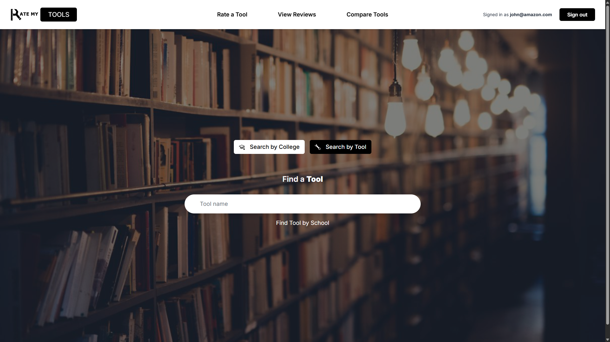
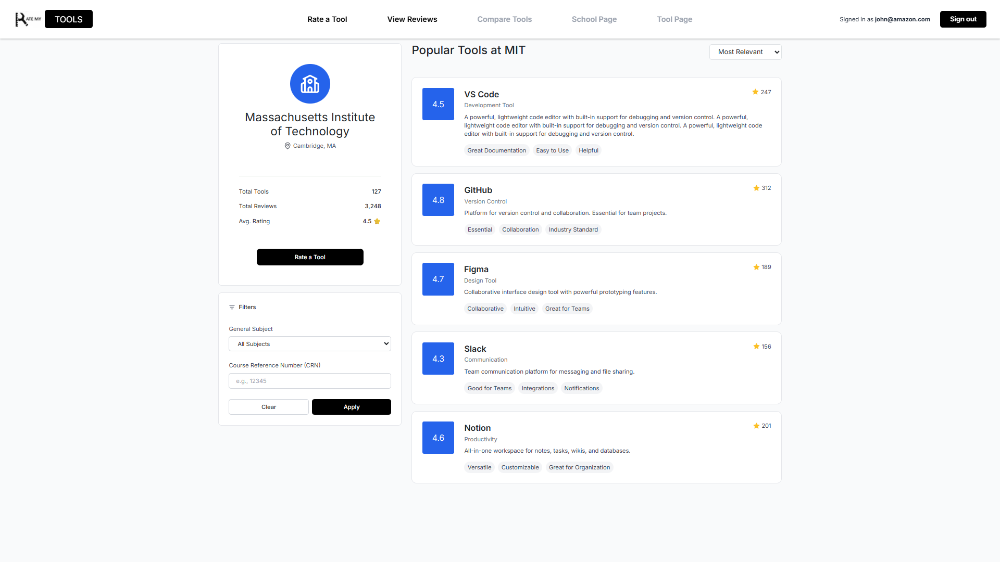

## Overview

RateMyTools is a collaborative web application designed to help students evaluate and compare educational tools and AI resources used in their classes. The platform allows users to view ratings and reviews for learning tools across different schools, giving students insight into how effective certain tools are based on real student experiences. Users can search by either tool or school, allowing them to see overall ratings, written reviews, and how tools are being used in different academic environments.

The application was developed as a team project, with both the front-end and back-end designed and managed through GitHub. It is connected to a Neon-hosted PostgreSQL database using Prisma, which stores user profiles, reviews, ratings, and tool and school information. Logged-in users are able to leave reviews and rate tools, while all users can interact with reviews using a thumbs-up or thumbs-down system to indicate helpfulness. In addition, the platform includes an AI-assisted comparison feature that helps users identify similar tools and compare them based on ratings and feedback, and AI-controlled moderation system for reviews.

---

## Landing Page

The RateMyTools landing page serves as the main entry point for the application, introducing users to the platform’s purpose and core functionality. From this page, users can quickly search for either a learning tool or a school to view ratings and student reviews, allowing them to immediately engage with the platform without unnecessary navigation. I specifically designed the navigation bar and overall user interface of the landing page, focusing on clarity, accessibility, and ease of use. Visual elements and spacing were used to promote usability, while the navigation bar provides clear access to other features such as comparisons and user accounts. This design approach prioritized usability and ensures a smooth first experience for new users.

---

## School Page

The school page was designed to provide users with a centralized view of what learning tools are being used and how they are rated at a specific institution. From this page, users can see a list of tools associated with the selected school, along with their overall ratings and review counts. This allows students to quickly understand which tools are most commonly used and which ones are viewed as the most helpful within that academic environment. It also features a filter option, where users can sort by course number or subject.

---

## UI Quality

https://github.com/USERNAME/REPO/blob/main/img/RMT_gif.mp4

To maintain UI consistency across the application, I oversaw the front-end design of the webpages. This included implementing features such as navigation bar scrolling behavior, standardized review tags and rating components, and consistent design choices related to spacing, color usage, layout, etc.

---

### Links
[Application](https://rate-my-tools-sc.vercel.app/)
[Organization](https://ratemytool.github.io/RateMyToolPage/)
